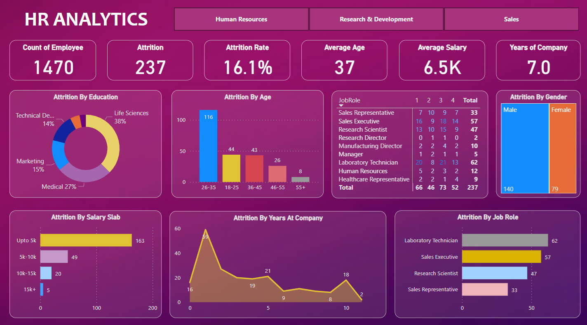

<h2 align="center">HR Analytics with Power BI</h2>

<a href="https://app.powerbi.com/view?r=eyJrIjoiMzc2MmM2MjEtNmNmYi00MzM4LWFkYTgtZWIzOGQ4NzI3ZjhjIiwidCI6ImMyOTMyNDU1LWIzZTctNDJhYi1hY2ExLWZhNTNmMjcxN2EyNSJ9">Link to Interactive Dashboard</a>

In this impactful HR analytics project, I utilized Power BI to conduct a thorough analysis of employee attribution within the organization. The analysis focused on key factors such as education, salary slab, age, gender, years at the company, and job role, providing valuable insights for strategic workforce planning.

1. Attribution by Education

2. Attribution by Salary Slab

3. Attribution by Age

4. Attribution by Gender

5. Attribution by Years at Company

6. Attribution by Job Role
